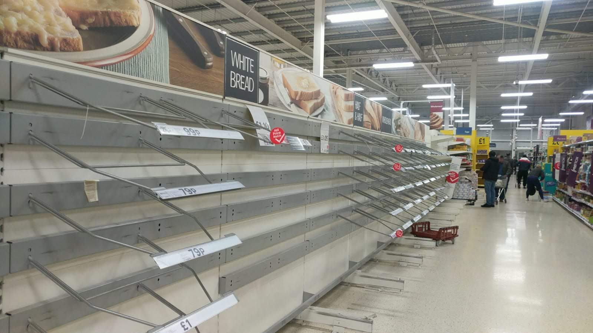

# Disaster Relief Effort

Data engineering using pre-labelled tweet and text messages from real life disasters; thanks to the company Figure Eight for their data.

## Introduction
After a disaster has occurred there are usually millions of communications right at the time that disaster response organizations have the least capacity to retrieve the most important messages.
Different organizations would generally take care of specific parts of the problem, like water, medical supplies, blocked roads. These are some of the categories that Figure Eight has pulled out of the data.
The expectation is that this project could be used in future disaster relief projects to benefit people affected during hard times.

Supervised Machine Learning is more accurate than a person performing keyword searches, and this is an issue in disaster relief. The data has been repaired with an ETL pipeline and then a machine learning pipeline was used to build a supervised learning model.

## Questions
Can the data be analyzed to divide messages so that the right organizations would be of most help to the people who need it?

## Findings
### Building the model
Pipelines are used to take in the data form the database, puts it through a tokenizer, tfidf transformer, two custom transformers which find messages related to death and children, and finally through the Random Forest classifier – to produce a trained model, which can then be used for prediction.

### FeatureUnions
Using Scikit-learn’s FeatureUnion class makes it easy to write complex pipelines by building smaller pieces (transformers) and then combining them horizontally.

### What happened after adding these features?
Accuracy went up to x%
Using Pipelines and FeatureUnions helped to orgainse the code for readability, reusability and easier experimentation.

## Conclusion
By adding in more features, and doing hyperparameter tuning, the accuracy reached x%.

------------------------------------------------------------------------------------------------------------------

# Implementation
## Technical Information

##### Libraries:
1. import sys
1. import re
1. import numpy
1. import pandas
1. import pickle
1. sqlalchemy
1. nltk
1. sklearn

### File Descriptions
1. process_data.py: the python code which cleans the data before adding it to a databcase
1. train_classifier.py: the python code which builds and evaluates a model for the data in the database and saves a dataframe to a pickle file, where the pickle library is used for serializing and deserializing objects.

messages.csv: messages created by thepublic in the native language, converted into english.
categories.csv: categories into which messages fall; water, medical, etc.

empty_shelves.jpg: a picture of empty shelves in a supermarket.

### Instructions:

### How To Interact With The Project
Install the files into a folder on your computer

1. Run the following commands in the project's root directory to set up your database and model.

    - To run ETL pipeline that cleans data and stores in database
        `python data/process_data.py data/disaster_messages.csv data/disaster_categories.csv data/DisasterResponse.db`
    - To run ML pipeline that trains classifier and saves
        `python models/train_classifier.py data/DisasterResponse.db models/classifier.pkl`

2. Run the following command in the app's directory to run your web app.
    `python run.py`

3. Go to http://0.0.0.0:3001/

### Licensing, Authors, Acknowledgements

The data files were retrieved from www.figure-eight.com
Thanks to my mentors at [Udacity]https://www.udacity.com/ for helping me to understand my results
